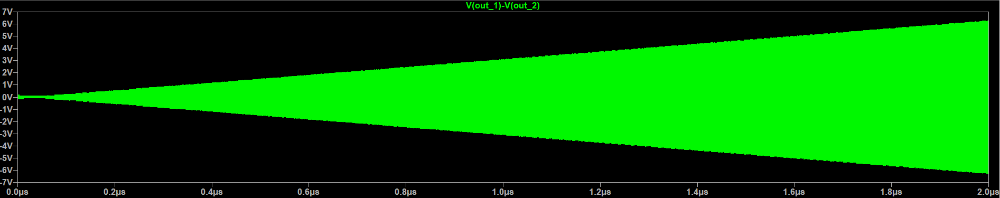

# 2.4 GHz CMOS RF Receiver Front-End

A full RF receiver front-end designed and simulated at the transistor level in **LTspice**, targeting the 2.4 GHz ISM band. This project serves as an RFIC/analog IC portfolio demonstrating competency in RF circuit simulation, oscillator design, resonance behavior, differential signaling, and receiver chain architecture — skills directly applicable to internship and graduate-level RF/analog IC roles.

---

## Table of Contents

1. [Project Overview](#project-overview)
2. [Receiver Architecture](#receiver-architecture)
3. [Folder Structure](#folder-structure)
4. [Block Descriptions](#block-descriptions)
5. [Simulation Results](#simulation-results)
6. [Screenshots & Plots](#screenshots--plots)
7. [Tools Used](#tools-used)
8. [Learning Outcomes](#learning-outcomes)
9. [Future Improvements](#future-improvements)

---

## Project Overview

This project implements the front-end of a 2.4 GHz CMOS RF receiver at the circuit level, covering the signal path from antenna input through to the intermediate frequency (IF) / baseband stage. Each block is independently simulated and characterized, with emphasis on:

- **Differential RF design** throughout the signal chain to maximize common-mode noise rejection
- **Transistor-level SPICE simulation** for accurate time-domain and AC behavior
- **Oscillator startup and steady-state analysis** using the negative resistance model
- **Impedance matching** for maximum power transfer and noise optimization

The design targets a receiver sensitivity suitable for short-range wireless communication, consistent with Bluetooth and IEEE 802.11b/g/n front-end specifications.

---

## Receiver Architecture

```
Antenna
   │
   ▼
┌─────────────────────┐
│  Matching Network   │  ← Transforms 50 Ω antenna impedance to LNA input optimum
└─────────┬───────────┘
          │
          ▼
┌─────────────────────┐
│        LNA          │  ← Low-noise amplification; differential cascode topology
└─────────┬───────────┘
          │
          ▼
┌─────────────────────┐     ┌─────────────────────┐
│       Mixer         │ ←── │    LC VCO (2.4 GHz) │  ← Cross-coupled NMOS, differential tank
└─────────┬───────────┘     └─────────────────────┘
          │
          ▼
┌─────────────────────┐
│     IF / BB Filter  │  ← Selects desired channel, rejects image and interferers
└─────────────────────┘
```

The architecture follows a **direct-conversion / low-IF heterodyne** approach. The VCO drives the mixer with a differential LO signal, down-converting the 2.4 GHz RF input to an intermediate or baseband frequency for further processing.

---

## Folder Structure

```
rf_receiver/
└── frontend/
    ├── 1_matching_network/     # Input impedance matching (L-network / LC pi-network)
    │   ├── notes/              # Design calculations and theory notes
    │   ├── plots/              # S-parameter and impedance plots
    │   └── schematics/         # LTspice .asc schematic files
    ├── 2_LNA/                  # Low Noise Amplifier design
    │   ├── notes/
    │   ├── plots/
    │   └── schematics/
    ├── 3_mixer/                # Down-conversion mixer (Gilbert cell or passive)
    │   ├── notes/
    │   ├── plots/
    │   └── schematics/
    ├── 4_VCO/                  # Cross-coupled LC VCO at 2.4 GHz
    │   ├── notes/
    │   ├── plots/
    │   │   └── vco_startup_differential.png
    │   └── schematics/
    │       ├── vco.asc                      # LTspice schematic
    │       ├── vco.net                      # Netlist
    │       └── working_lc_vco_verify.cir    # SPICE verification testbench
    ├── 5_IF_filter/            # IF / baseband filter
    │   ├── notes/
    │   ├── plots/
    │   └── schematics/
    └── results/                # Top-level simulation results and summaries
```

---

## Block Descriptions

### 1 — Matching Network
Transforms the 50 Ω source impedance presented by the antenna to the optimum noise or power impedance at the LNA input. Designed using LC networks with simulation of reflection coefficient (S11) and power transfer efficiency.

### 2 — Low Noise Amplifier (LNA)
Provides the first stage of amplification with minimum added noise. A differential cascode topology is used to achieve high gain, good reverse isolation, and improved linearity. Key figures of merit include noise figure (NF), voltage gain, and input-referred third-order intercept point (IIP3).

### 3 — Mixer
Down-converts the amplified 2.4 GHz RF signal to IF/baseband using the LO signal from the VCO. A double-balanced topology (e.g., Gilbert cell) suppresses LO feedthrough and improves port-to-port isolation.

### 4 — LC VCO
A cross-coupled NMOS pair provides negative resistance to sustain oscillation in a differential LC tank. The tank resonates at 2.4 GHz, determined by the inductor and varactor values. Transient simulation confirms oscillator startup, with envelope amplitude growing from noise until reaching steady-state limited by transistor nonlinearity.

> **Simulation note:** The differential output showed oscillator startup, with amplitude increasing over time due to the negative resistance generated by the cross-coupled pair.

### 5 — IF / Baseband Filter
Selects the desired signal channel while rejecting the image frequency, out-of-band interferers, and LO leakage. Implemented as an active or passive low-pass / bandpass filter tuned to the IF bandwidth.

---

## Simulation Results

| Block             | Metric                  | Result / Status         |
|-------------------|-------------------------|-------------------------|
| Matching Network  | S11 at 2.4 GHz          | In progress             |
| LNA               | Noise Figure            | In progress             |
| LNA               | Voltage Gain            | In progress             |
| Mixer             | Conversion Gain         | In progress             |
| Mixer             | LO-RF Isolation         | In progress             |
| LC VCO            | Oscillation Frequency   | ~2.4 GHz (verified)     |
| LC VCO            | Startup Transient       | Confirmed (differential)|
| IF Filter         | -3 dB Bandwidth         | In progress             |

---

## Screenshots & Plots

### LC VCO — Differential Startup Transient



*Differential output of the cross-coupled LC VCO. The envelope amplitude grows from initial conditions as the negative resistance overcomes tank losses, reaching steady-state oscillation at the LC resonant frequency.*

---

## Tools Used

| Tool       | Purpose                                              |
|------------|------------------------------------------------------|
| **LTspice** | Transistor-level SPICE simulation (transient, AC, operating point) |
| **SPICE netlists** | Portable circuit description and testbench verification |
| **Git / GitHub** | Version control and project portfolio hosting    |

---

## Learning Outcomes

- **Oscillator design:** Applied the negative resistance and Barkhausen criteria to design a cross-coupled LC VCO; verified startup behavior and steady-state amplitude through transient simulation.
- **Differential signaling:** Designed the full receiver chain with differential topologies to reject supply noise, substrate coupling, and common-mode interference — a core requirement in modern RFIC design.
- **Impedance matching:** Practiced L-network and LC pi-network synthesis for conjugate and noise-optimal matching at RF frequencies.
- **Receiver chain architecture:** Gained end-to-end understanding of how gain, noise figure, and linearity (NF, IIP3) cascade through an RF front-end using Friis's formula.
- **SPICE simulation methodology:** Developed structured simulation workflows including AC analysis, transient startup verification, operating-point checks, and netlist-based testbenches.
- **RF system trade-offs:** Explored the relationships between gain, noise, linearity, and power consumption inherent in low-power CMOS RF design.

---

## Future Improvements

- [ ] Complete LNA design and characterize NF, gain, and IIP3
- [ ] Integrate Gilbert cell mixer and simulate conversion gain and port isolation
- [ ] Add varactor tuning to the VCO and sweep oscillation frequency vs. control voltage (Kvco characterization)
- [ ] Implement phase noise analysis on the VCO using LTspice noise simulation
- [ ] Connect blocks into a full receiver chain and perform end-to-end cascaded NF and gain simulation
- [ ] Add a baseband amplifier / ADC driver stage
- [ ] Migrate design to a PDK (e.g., TSMC 180 nm or SKY130) for layout-aware simulation
- [ ] Generate S-parameter data and compare against published 2.4 GHz CMOS receiver benchmarks

---

*Designed and simulated by Will Arato — RFIC/Analog IC Portfolio Project*
